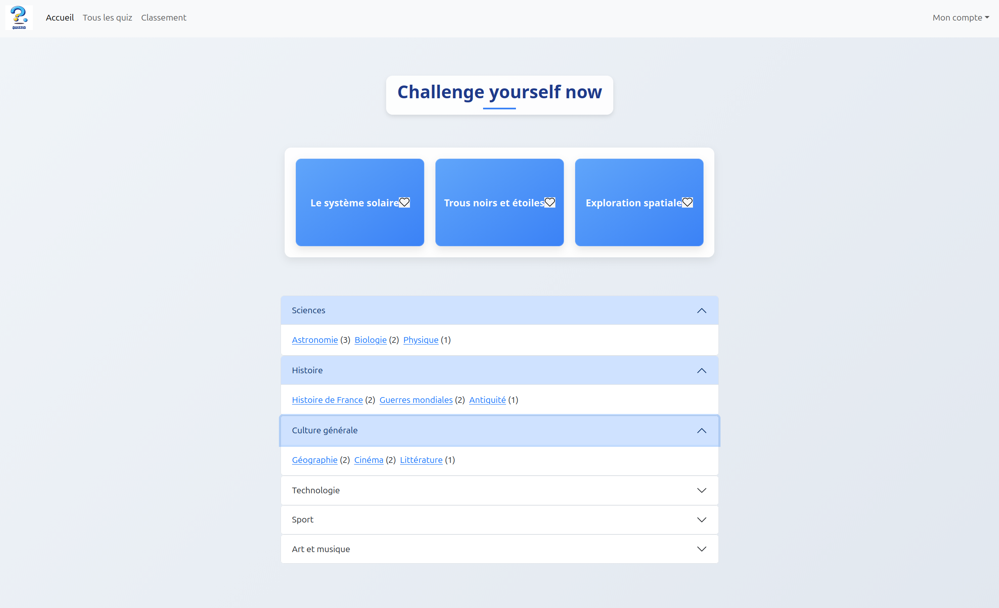
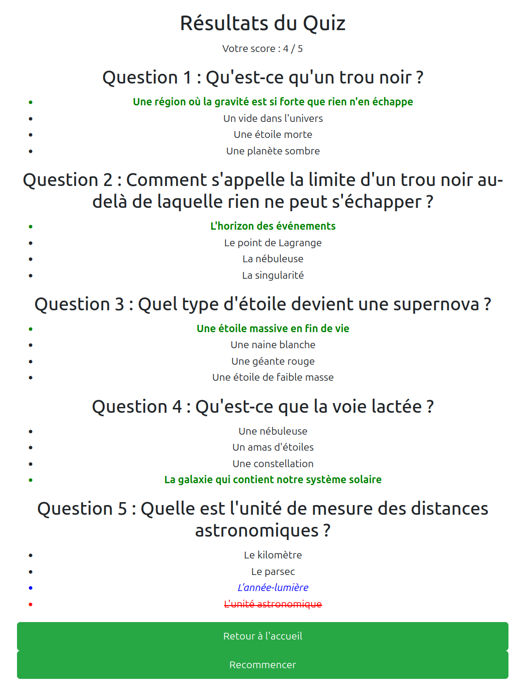

# Quizzio

Application web de quiz en ligne, développée avec **Flask** (backend) et **React + Vite** (frontend).

## Aperçu




## Fonctionnalités

- Inscription et connexion avec activation par e-mail
- Création de quiz personnalisés (catégorie, thème, difficulté, questions à choix multiples)
- Passage de quiz avec correction immédiate
- Système de scores et de favoris
- Classement des joueurs (par points ou par moyenne)
- Réinitialisation de mot de passe par e-mail
- Upload de photo de profil

## Structure du projet

```
quizzio/
├── backend/
│   ├── app.py              # API Flask (routes, modèle de la base de données)
│   ├── requirements.txt    # Dépendances Python
│   └── static/
│       └── uploads/
│           └── profile_pics/   # Photos de profil uploadées
└── frontend/
    ├── src/
    │   ├── constants.js    # URL du backend
    │   ├── AuthContext.jsx # Contexte d'authentification React
    │   ├── App.jsx         # Routage principal
    │   └── ...             # Composants par page
    ├── package.json
    └── vite.config.js
```

## Installation

### Prérequis

- Python 3.10+
- Node.js 18+
- MySQL

---

### Backend

```bash
cd backend

# Créer et activer un environnement virtuel
python3 -m venv venv
source venv/bin/activate

# Installer les dépendances
pip install -r requirements.txt

# Configurer les variables d'environnement
touch .env
# Éditez .env avec vos valeurs
```

| Variable             | Description                                      |
|----------------------|--------------------------------------------------|
| `SECRET_KEY`         | Clé secrète Flask
| `DB_USERNAME`        | Nom d'utilisateur MySQL                          |
| `DB_PASSWORD`        | Mot de passe MySQL                               |
| `DB_HOST`            | Hôte MySQL (ex : `localhost`)                    |
| `DB_NAME`            | Nom de la base de données                        |
| `MAIL_USERNAME`      | Adresse Gmail pour l'envoi d'e-mails             |
| `MAIL_PASSWORD`      | Mot de passe d'application Gmail                 |
| `MAIL_DEFAULT_SENDER`| Adresse expéditrice par défaut                   |
| `FRONTEND_URL`       | URL du frontend (pour les liens dans les e-mails)|

> **Note Gmail** : Pour utiliser Gmail, activez [les mots de passe d'application](https://support.google.com/accounts/answer/185833) dans votre compte Google.

---

```bash
# Créer des enregistrements fictifs pour visualiser 
python3 enregistrements.py 

# Lancer le serveur
python3 app.py
```

Le backend sera disponible sur `http://localhost:5000`.

### Frontend

```bash
cd frontend

# Installer les dépendances
npm install

# Lancer le serveur de développement
npm run dev
```

Le frontend sera disponible sur `http://localhost:5173`.

## ROUTES API

### Authentification

| Méthode | Route                           | Description                        |
|---------|---------------------------------|------------------------------------|
| POST    | `/api/sign-up`                  | Inscription                        |
| POST    | `/api/sign-in`                  | Connexion                          |
| POST    | `/api/logout`                   | Déconnexion                        |
| GET     | `/api/check-auth`               | Vérifier la session                |
| GET     | `/api/activate/<token>`         | Activer le compte                  |
| POST    | `/api/resend-activation`        | Renvoyer le lien d'activation      |
| POST    | `/api/reset-password`           | Demander une réinitialisation      |
| POST    | `/api/reset-password/<token>`   | Confirmer la réinitialisation      |

### Quiz

| Méthode | Route                              | Description                        |
|---------|------------------------------------|------------------------------------|
| GET     | `/api/homeQuiz`                    | Quiz de la page d'accueil          |
| GET     | `/api/quiz-by-theme?theme_name=X`  | Quiz par thème                     |
| POST    | `/api/createQuiz`                  | Créer un quiz                      |
| GET     | `/api/quizzes/<id>/questions`      | Questions d'un quiz                |
| POST    | `/api/quizzes/<id>/finish`         | Soumettre le score                 |

### Utilisateur

| Méthode | Route                   | Description                        |
|---------|-------------------------|------------------------------------|
| GET     | `/api/get_my_quizzes`   | Mes quiz créés                     |
| GET     | `/api/get_my_favorites` | Mes favoris                        |
| GET     | `/api/get_my_scores`    | Mes scores                         |
| POST    | `/api/toggle-favorite`  | Ajouter/retirer un favori          |
| GET     | `/api/ranking`          | Classement général                 |
| GET     | `/api/settings`         | Récupérer le profil                |
| PATCH   | `/api/settings`         | Modifier le profil                 |

---

## Technologies utilisées

**Backend**
- [Flask](https://flask.palletsprojects.com/) — framework web Python
- [Flask-SQLAlchemy](https://flask-sqlalchemy.palletsprojects.com/) — ORM
- [Flask-Mail](https://flask-mail.readthedocs.io/) — envoi d'e-mails
- [Flask-CORS](https://flask-cors.readthedocs.io/) — gestion du CORS
- [itsdangerous](https://itsdangerous.palletsprojects.com/) — tokens sécurisés
- [Werkzeug](https://werkzeug.palletsprojects.com/) — sécurité des mots de passe

**Frontend**
- [React](https://react.dev/) — interface utilisateur
- [Vite](https://vitejs.dev/) — build tool
- [React Router](https://reactrouter.com/) — routage
- [Bootstrap](https://getbootstrap.com/) — composants CSS

